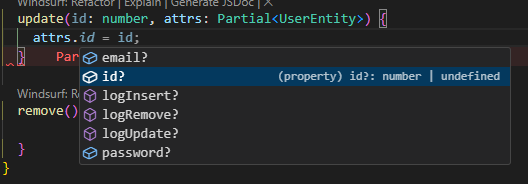
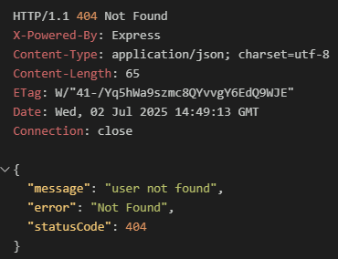
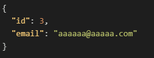
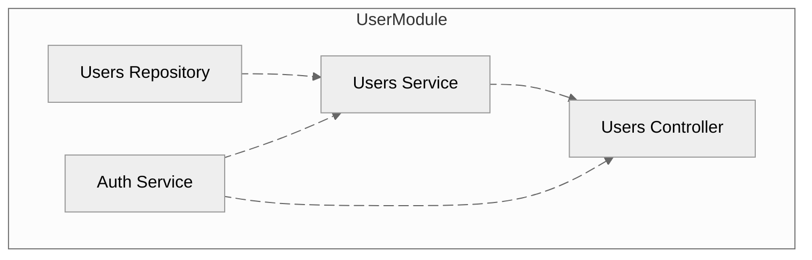
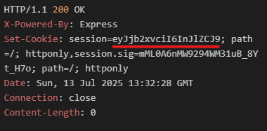
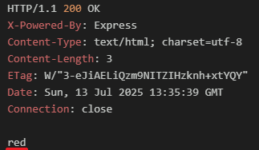
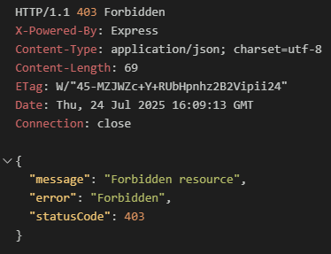

# My Car Value

## 목차

- **Section 07. 본격 프로젝트 시작**
  - [38. 앱개요](#38-앱-개요)
  - [39. API 설계](#39-api-설계)
  - [40. 모듈 설계](#40-모듈-설계)
  - [41. 모듈, 컨트롤러, 서비스 생성하기](#41-모듈-컨트롤러-서비스-생성하기)
- **Section 08. TypeORM을 이용해 데이터 보관하기**
  - [42. Nest를 이용한 영구 데이터를](#42-nest를-이용한-영구-데이터를)
  - [43. 데이터베이스 연결 설정](#43-데이터베이스-연결-설정)
  - [44. 엔터티와 리포지토리 생성하기](#44-엔터티와-리포지토리-생성하기)
  - [45. 데이터베이스 내용 보기](#45-데이터베이스-내용-보기)
  - [46. TypeORM 데코레이터 이해하기](#46-typeorm-데코레이터-이해하기)
  - [47. 리포지토리에 관한 짤막한 설명](#47-리포지토리에-관한-짤막한-설명)
  - [48. 몇 가지 추가 경로](#48-몇-가지-추가-경로)
  - [49. 본문 검증 설정하기](#49-본문-검증-설정하기)
  - [50. 수동으로 경로 테스트하기](#50-수동으로-경로-테스트하기)
- **Section 09. 사용자 데이터 생성 및 저장**
  - [51. 사용자 생성과 저장](#51-사용자-생성과-저장)
  - [52. 간단한 리뷰](#52-간단한-리뷰)
  - [53. 생성과 저장에 관한 추가 내용](#53-생성과-저장에-관한-추가-내용)
  - [54. find()와 findOne() 메서드에 필요한 업데이트](#54-find와-findone-메서드에-필요한-업데이트)
  - [55. 데이터 쿼리](#55-데이터-쿼리)
  - [56. 데이터 업데이트](#56-데이터-업데이트)
  - [57. 사용자 삭제](#57-사용자-삭제)
  - [58. 레코드 검색과 필터링](#58-레코드-검색과-필터링)
  - [59. 레코드 삭제](#59-레코드-삭제)
  - [60. 레코드 업데이트](#60-레코드-업데이트)
  - [61. 예외에 관한 사항](#61-예외에-관한-사항)
- **Section 10. 커스텀 데이터 직렬화**
  - [62. 응답 속성 제외](#62-응답-속성-제외)
  - [63. 직렬화 솔루션](#63-직렬화-솔루션)
  - [64. 인터셉터 구현 방법](#64-인터셉터-구현-방법)
  - [65. 인터셉터 내 직렬화](#65-인터셉터-내-직렬화)
  - [66. 인터셉터 DTO 커스터마이즈](#66-인터셉터-dto-커스터마이즈)
  - [67. 데코레이터에 인터셉터 포함하기](#67-데코레이터에-인터셉터-포함하기)
  - [68. 컨트롤러 범위의 직렬화](#68-컨트롤러-범위의-직렬화)
  - [69. 직렬화 타입 안정성](#69-직렬화-타입-안정성)
- **Section 11. 기초부터 배우는 인증**
  - [70. 인증 개요](#70-인증-개요)
  - [71. 서비스 셋업 복습](#71-서비스-셋업-복습)
  - [72. 가입하기 구현하기](#72-가입하기-구현하기)
  - [73. (선택) 비밀번호 해시 암호화 이해하기](#73-선택-비밀번호-해시-암호화-이해하기)
  - [74. 해시와 솔트로 비밀번호 암호화하기](#74-해시와-솔트로-비밀번호-암호화하기)
  - [75. 사용자 생성하기](#75-사용자-생성하기)
  - [76. 사용자 로그인 처리하기](#76-사용자-로그인-처리하기)
  - [77. 세션 설정하기](#77-세션-설정하기)
  - [78. 세션 데이터 변경 및 조회하기](#78-세션-데이터-변경-및-조회하기)
  - [79. 사용자 로그인시키기](#79-사용자-로그인시키기)
  - [80. 현재 사용자 조회하기](#80-현재-사용자-조회하기)
  - [81. 사용자 로그아웃시키기](#81-사용자-로그아웃시키기)
  - [82. 자동화 도구 둘](#82-자동화-도구-둘)
  - [83. Param 데코레이터 직접 만들기](#83-param-데코레이터-직접-만들기)
  - [84. 데코레이터와 인터셉터를 쓰는 이유는](#84-데코레이터와-인터셉터를-쓰는-이유는)
  - [85. 인터셉터에서 데코레이터로 정보 전달하기](#85-인터셉터에서-데코레이터로-정보-전달하기)
  - [86. CurrentUserInterceptor를 약간 수정하기](#86-currentuserinterceptor를-약간-수정하기)
  - [87. 인터셉터를 의존성 주입과 연결하기](#87-인터셉터를-의존성-주입과-연결하기)
  - [88. 전역적인 인터셉터](#88-전역적인-인터셉터)
  - [89. 인증 가드를 이용하여 접근 제어하기](#89-인증-가드를-이용하여-접근-제어하기)
- **Section 12. 단위 테스트 시작하기**
  - [90. 테스트 개요](#90-테스트-개요)
  - [91. 테스트 설정](#91-테스트-설정)
  - [92. 네, 테스트는 헷갈립니다](#92-네-테스트는-헷갈립니다)
  - [93. 모의 구현에 타입스크립트 이용하기](#93-모의-구현에-타입스크립트-이용하기)
  - [94. 테스트 속도 향상에 도움을 주는 간단 참고사항](#94-테스트-속도-향상에-도움을-주는-간단-참고사항)
  - [95. 파일 레이아웃 개선](#95-파일-레이아웃-개선)
  - [96. 비밀번호 해시 처리](#96-비밀번호-해시-처리)
  - [97. jest 변경으로 'Email in Use'테스트를 리팩터링](#97-jest-변경으로-email-in-use테스트를-리팩터링)
  - [98. 모의 구현 변경](#98-모의-구현-변경)
  - [99. jest 변경으로 'Unused Email'테스트를 리팩터링](#99-jest-변경으로-unused-email테스트를-리팩터링)
  - [100. 로그인 흐름 테스트](#100-로그인-흐름-테스트)
  - [101. jest 변경으로 'Invalid Password'테스트를 리팩터링](#101-jest-변경으로-invalid-password테스트를-리팩터링)
  - [102. 비밀번호 비교 확인](#102-비밀번호-비교-확인)
  - [103. 더욱 지능적인 모의 구현](#103-더욱-지능적인-모의-구현)
  - [104. jest 변경으로 Mock 3개를 리팩터링](#104-jest-변경으로-mock-3개를-리팩터링)
  - [105. 지능적인 모의 구현 사용을 위해 리팩터링](#105-지능적인-모의-구현-사용을-위해-리팩터링)
  - [106. 컨트롤러 단위 테스트](#106-컨트롤러-단위-테스트)
  - [107. 추가 모의 구현](#107-추가-모의-구현)
  - [108. jest 변경으로 'User id is not found'테스트를 리팩터링](#108-jest-변경으로-user-id-is-not-found테스트를-리팩터링)
  - [109. 효과가 떨어지는 테스트](#109-효과가-떨어지는-테스트)
  - [110. signin 메서드 테스트](#110-signin-메서드-테스트)
- **Section 13. 통합 테스트**
  - [111. 엔드투엔드 테스트 시작하기](#111-엔드투엔드-테스트-시작하기)
  - [112. 엔드투엔드 테스트 만들기](#112-엔드투엔드-테스트-만들기)
  - [113. spec 파일에서의 앱 설정 문제](#113-spec-파일에서의-앱-설정-문제)
  - [114. 전역 범위 파이프 적용](#114-전역-범위-파이프-적용)
  - [115. 전역 범위 미들웨어 적용](#115-전역-범위-미들웨어-적용)
  - [116. 반복 테스트 실행 실패 해결](#116-반복-테스트-실행-실패-해결)
  - [117. 별도의 테스트 데이터베이스 및 개발 데이터베이스 만들기](#117-별도의-테스트-데이터베이스-및-개발-데이터베이스-만들기)

---

## Section 07. 본격 프로젝트 시작

### 38. 앱 개요

중고차 견적을 내주는 API를 만든다.

이메일과 패스워드를 이용한 회원 가입 기능을 제공한다. 차종, 모델, 연식, 주행거리에 따라 예상 가격을 산정한다.
실제로 판매한 금액을 사용자에게 입력받는다. 그런 다음, 그 금액을 이용해 앞으로 문의하는 차량의 가격을 추산하는 능력을 더 보완한다.
사용자가 차량을 판매했다고 보고할 때마다 데이터를 관리자가 검토한다.

### 39. API 설계

앞으로 만들어야 할 API에 대해 설명한다.
Method and Route, Body or Query String, Description으로 나누어서 설명한다.
회원 가입, 로그인, 리포트 생성/조회/갱신

### 40. 모듈 설계

`Users`, `Reports` 모듈에 대해 설명한다.
각 모듈은 컨트롤러, 서비스, 리포지토리로 구성할 예정이다.

### 41. 모듈, 컨트롤러, 서비스 생성하기

NextJs CLI로 `Users`, `Reports` 각각 모듈, 컨트롤러, 서비스를 생성한다.

---

## Section 08. TypeORM을 이용해 데이터 보관하기

### 42. Nest를 이용한 영구 데이터를

TypeORM은 NestJS에서 지원하는 도구가 있어서 궁합이 좋다고 한다.
따라서 TypeORM과 DB는 SQLite를 사용하기로 하였다. 패키지를 설치하자.
`npm install @nestjs/typeorm typeorm sqlite3`

### 43. 데이터베이스 연결 설정

DB와 `AppModule`를 연결하여 다른 모듈에서도 사용할 수 있도록 설정한다.

`UsersModule`과 `ReportsModule`은 각각 `Entity`와 `Repository`를 가진다.
엔터티에는 데이터베이스에 필요한 속성들을 정의한다.
리포지토리에는 데이터베이스 기능을 정의한다.

```ts
// app.module.ts
import { Module } from '@nestjs/common';
import { TypeOrmModule } from '@nestjs/typeorm'; // 추가
import { AppController } from './app.controller';
import { AppService } from './app.service';
import { UsersModule } from './users/users.module';
import { ReportsModule } from './reports/reports.module';

@Module({
  imports: [
    TypeOrmModule.forRoot({ // TypeORM 설정
      type: 'sqlite',
      database: 'db.sqlite',
      entities: [],
      synchronize: true,
    }),
    UsersModule,
    ReportsModule,
  ],
  controllers: [AppController],
  providers: [AppService],
})
export class AppModule {}
```

`npm run start:dev` 명령어로 실행하면 root폴더에 `db.sqlite` 파일이 생성되는 것을 확인할 수 있다.

### 44. 엔터티와 리포지토리 생성하기

엔터티를 생성하는 과정 3단계를 소개한다.
1단계는 엔터티 파일을 만들고 그 안에 클래스를 생성한다. 이 클래스는 엔터티에 있어야 할 것으로 예상되는 다양한 속성들을 모두 열거한다.
`user.entity.ts` 파일을 생성하고 아래와 같이 구성한다.

```ts
// user.entity.ts
import { Entity, PrimaryGeneratedColumn, Column } from 'typeorm';

@Entity()
export class UserEntity {
  @PrimaryGeneratedColumn()
  id: number;

  @Column()
  email: string;

  @Column()
  password: string;
}
```

2단계는 엔터티를 부모 모듈에 연결한다. `user.module.ts` 파일에서 설정한다.

```ts
import { Module } from '@nestjs/common';
import { TypeOrmModule } from '@nestjs/typeorm';
import { UsersController } from './users.controller';
import { UsersService } from './users.service';
import { UserEntity } from './user.entity';

@Module({
  imports: [TypeOrmModule.forFeature([UserEntity])], // forFeature메서드를 사용하여 엔터티를 등록한다.
  controllers: [UsersController],
  providers: [UsersService]
})
export class UsersModule {}
```

3단계는 엔터티를 루트 커넥션으로 연결한다.

```ts
// app.module.ts
import { UserEntity } from './users/user.entity';
...

@Module({
  imports: [
    TypeOrmModule.forRoot({
      type: 'sqlite',
      database: 'db.sqlite',
      entities: [UserEntity], // 엔터티 추가
      synchronize: true,
    }),
    UsersModule,
    ReportsModule,
  ],
  ...
})
```

### 45. 데이터베이스 내용 보기

reports도 이전 과정과 마찬가지로 엔터티를 만들고 루트에 연결한다.
`db.sqlite`파일은 바이너리로 되어있어서 제대로 된 구성을 보기 위해서는 익스텐션을 설치해야한다.
`SQLite Viewer`를 설치하고 파일을 확인하면, 정의한 엔터티들이 테이블로 생성된 것을 확인할 수 있다.

### 46. TypeORM 데코레이터 이해하기

`app.module.ts`에서 설정한 `TypeOrmModule.forRoot`에서 `synchronize` 옵션은 엔터티를 동기화하여 테이블이 없으면 생성해주고, 변경되 었다면 적용해주는 옵션이다.

### 47. 리포지토리에 관한 짤막한 설명

앞으로 우리가 구성할 리포지토리 API에 대해 설명한다.
create(), save(), find(), findOne(), remove()
save()는 insert/update를 둘 다 수행하는 메서드이다.

### 48. 몇 가지 추가 경로

구성할 메서드 그리고 라우터에 대한 설명과 이를 구현하기 위한 컨트롤러 메서드를 설명한다.
createUser, findUser, findAllUser, updateUser, removeUser

### 49. 본문 검증 설정하기

이전 프로젝트와 마찬가지로 `class-validator`, `class-transformer` 패키지를 설치하였다.
그리고 `create-user.dto.ts` dto를, `main.ts`에서 `ValidationPipe`를 구성하였다.

```ts
app.useGlobalPipes(
  new ValidationPipe({
    whitelist: true,
  }),
);
```

### 50. 수동으로 경로 테스트하기

`requests.http` 파일을 생성하여 아래와 같이 설정

```http
### Create a new user
POST http://localhost:3000/auth/signup
content-type: application/json

{
  "email": "asdf@asdf.com",
  "password": "asdfasdf"
}
```

메인에 `ValidationPipe`를 설정할 떄 `whitelist` 옵션의 역할은 예를들어 유저 dto에서 설정한 데이터 보다 많은 데이터가 `body`에 포함된 경우 이를 무시해주는 옵션이다.

예를들어 요청 body JSON에 `admin: true` 같은 옵션을 추가하여, 원치않는 기능 작동으로 보안상 문제가 발생할 수 있으므로 방지해주는 것이다.

---

## Section 09. 사용자 데이터 생성 및 저장

### 51. 사용자 생성과 저장

`TypeORM`을 사용하여 리포지토리 의존성 주입을 하려면 아래와 같이 구성해야 한다.
`Repository`는 리포지토리 타입을 명시해주는 것인데 제네릭 타입으로 `TypeORM`으로 만든 엔터티를 지정해주면 된다.
제네릭 타입을 통해 의존성 주입을 위해서는 `InjectRepository` 데코레이터를 사용해야 한다.

그리고 `create` 메서드를 정의한다. 이메일과 패스워드를 받아서 리포지토리에 생성하고 저장한다.

그리고 실제적으로 요청을 받는 라우터 컨트롤러에 `createUser` 메서드를 정의한다.
테스트 결과 DB에 잘 적용 된 것을 확인할 수 있다.

```ts
// users.service.ts
import { Injectable } from '@nestjs/common';
import { Repository } from 'typeorm';
import { UserEntity } from './user.entity';
import { InjectRepository } from '@nestjs/typeorm'; // 제네릭 타입의 의존성 주입

@Injectable()
export class UsersService {
  constructor(
    @InjectRepository(UserEntity) private repo: Repository<UserEntity>,
  ) {}

  create(email: string, password: string) {
    const user = this.repo.create({ email, password });

    return this.repo.save(user);
  }
}

// users.service.ts
import { Body, Controller, Post } from '@nestjs/common';
import { CreateUserDto } from './dtos/create-user.dto';
import { UsersService } from './users.service';

@Controller('auth')
export class UsersController {
  constructor(private usersService: UsersService) {}

  @Post('/signup')
  createUser(@Body() body: CreateUserDto) {
    this.usersService.create(body.email, body.password);
  }
}
```

### 52. 간단한 리뷰

```ts
// users.service.ts
@Injectable()
export class UsersService {
  constructor(
    @InjectRepository(UserEntity) private repo: Repository<UserEntity>,
  ) {}

  create(email: string, password: string) {
    const user = this.repo.create({ email, password });
    return this.repo.save(user);
  }
}
```

`user.service.ts`에서 `create()`와 `save()`를 왜 각각 사용하는지 설명한다.
`create()` 메서드는 새로운 엔터티 인스턴스를 생성하고 데이터를 설정하는 기능이다.
`save()` 메서드는 실제로 엔터티를 가져와서 데이터베이스에 저장하는 기능을 한다.

`save()` 메서드만 있으면 데이터를 저장할 수 있는데 `create()` 메서드를 사용하는 이유는 유효성 검사를 실행하려면 엔터티 인스턴스가 필요하기 때문이다.
유효성 검사를 하고, 유효성 검사를 마친 데이터를 실제 데이터베이스에 저장하기 위함이다.

### 53. 생성과 저장에 관한 추가 내용

후크는 특정 시점에 자동으로 호출되는 엔터티에 함수를 정의한다. `create` 메서드를 통해 엔터티 인스턴스가 생성되어야 후크도 작동한다.

```ts
import { Entity, PrimaryGeneratedColumn, Column, AfterInsert, AfterRemove, AfterUpdate } from 'typeorm';

@Entity()
export class UserEntity {
  ...

  @AfterInsert() // 후크 insert될 때 호출된다.
  logInsert() {
    console.log(`Inserted user with id ${this.id}`);
  }

  @AfterUpdate()
  logUpdate() {
    console.log(`Updated user with id ${this.id}`);
  }

  @AfterRemove()
  logRemove() {
    console.log(`Removed user with id ${this.id}`);
  }
}

```

### 54. find()와 findOne() 메서드에 필요한 업데이트

0.3.0 TypeORM 릴리스부터 `findBy()`를 더 이상 사용하지 않는다.

따라서 `findOne()` 메서드를 찾아서 반환문을 다음과 같이 설정한다.

```ts
return this.repo.findOneBy({ id });
```

`find()` 메서드를 찾아서 리턴문을 다음과 같이 설정한다.

```ts
return this.repo.find({ where: { email } });
```

### 55. 데이터 쿼리

서비스 함수 정의하기

### 56. 데이터 업데이트

타입스크립트에서 지원하는 `Partial<T>` 제네릭은 모든 옵션을 선택적으로 만들어준다.
`attrs: Partial<UserEntity>`은 `UserEntity`의 속성들을 옵셔널로 만들어 준다는 뜻이다.



유저 서비스의 `update()` 메서드를 작성한다.

레포지토리의 `save()` 메서드를 사용하는 것은 `insert()` 메서드와 `update()` 메서드를 합쳐놓은 기능과 같다.

새로운 엔티티 인스턴스를 전달하면 `INSERT` 쿼리가 실행되고, `@AfterInsert` 후크가 호출된다.
기존 엔티티를 수정하여 전달하면 `UPDATE` 쿼리가 실행되고, `@AfterUpdate` 후크가 호출된다.

차이점은 `insert()`와 `update()`는 직접적인 SQL `INSERT` 또는 `UPDATE` 쿼리를 실행하는 것과 같다. 그렇기 때문에 후크가 없다.

### 57. 사용자 삭제

`remove()` 메서드를 사용하면 `@AfterRemove()` 후크가 호출 된다. 엔터티를 매개변수로 받는다. `remove(Entity)`
`delete()` 메서드는 직접적인 SQL `DELETE` 쿼리를 실행하는 것과 같다. 후크가 없다.

### 58. 레코드 검색과 필터링

`user.services.ts` 파일에 버전 업데이트로 사용법이 바뀐 부분을 수정하였다.
`user.controller.ts`에 `findUser()` 메서드와 `findAllUsers()` 메서드를 정의하였다.

### 59. 레코드 삭제

`user.controller.ts` 삭제 로직 추가

### 60. 레코드 업데이트

업데이트 요청 데이터가 상이할 수 있다.
이메일과 패스워드 모두 바꾸거나, 이메일만 바꾸거나, 패스워드만 바꾸는 경우 등
따라서 `UpdateUserDto`를 정의하고 컨트롤러에 업데이트 로직을 추가한다.

### 61. 예외에 관한 사항

Nest에서 구현된 예외 함수에 대해 배우는 시간이었다.



---

## Section 10. 커스텀 데이터 직렬화

### 62. 응답 속성 제외

지금은 유저의 데이터 요청시 패스워드를 그대로 노출하고 있지만
보안상 노출되면 안되는 데이터나 불필요한 데이터가 응답되지 않도록 해야 한다.

`class-transformer` 패키지에서 `Exclude()` 데코레이터를 이용하여 지정한 데이터를 응답 데이터에서 제외시킬 수 있다.

`Class Serializer Interceptor`를 이용하여 응답 엔터티 인터페이스를 가로채서
응답 데이터를 조정한다.

### 63. 직렬화 솔루션

공개 라우터와 비공개 라우터에 대하여 설명한다.
관리자는 사용자의 상세 정보를 모두 볼 수 있어야 한다. 따라서, 관리자 라우트 핸들러를 만들어야 한다.
커스텀 인터셉터를 만들어서 사용자 엔터티 인스턴스를 DTO에 설정된 직렬화 규칙에 따라 일반 객체로 바꾸고 일반 JSON으로 바꾼다.
사용자 DTO가 사용자 엔터티를 형식화하는 방법을 규정하도록 만든다.

커스텀 DTO를 만들어서 서로 다른 사용자 엔터티 직렬화 방법을 정의한다.

### 64. 인터셉터 구현 방법

인터셉터는 나가는 응답이나 들어오는 요청을 가로채는 데 사용한다.
인터셉터를 만들 떄마다 각 라우트 핸들러에 적용할 수 있다.
그리고 인터셉터를 전체 컨트롤러에 적용할 수도 있다.

커스텀 인터셉터를 만들었다. `serialize.interceptor.ts`

`users.controller.ts` 파일에서 `findUser()` 메서드에 설정된 인터셉터를 커스텀한 인터셉터로 바꿔주고, 콘솔 로그에 실행 순서를 확인하였다.

```ts
// serialize.interceptor.ts
export class SerializeInterceptor implements NestInterceptor {
  intercept(context: ExecutionContext, handler: CallHandler): Observable<any> {
    // 요청 핸들러가 요청을 처리하기 전에 무언가를 실행합니다.
    console.log('나는 핸들러 전에 실행됩니다.', context);

    return handler.handle().pipe(
      map((data: any) => {
        // 응답이 발송되기 전에 무언가를 실행하십시오
        console.log('응답이 발송되기 전에 실행 중입니다', data);
      }),
    );
  }
}

// users.controller.ts
@UseInterceptors(SerializeInterceptor)
@Get('/:id')
async findUser(@Param('id') id: string) {
  console.log('핸들러가 실행 중입니다.');
  const user = await this.usersService.findOne(parseInt(id));
  if (!user) {
    throw new NotFoundException('user not found');
  }
  return user;
}
```

1. 핸들러가 실행 중입니다
2. 나는 핸들러 전에 실행됩니다.
3. 응답이 발송되기 전에 실행 중입니다.

### 65. 인터셉터 내 직렬화

인터셉터에서 내보낼 데이터를 구성하기 위해 `UserDto`를 설계하였다.
따라서 유저 응답 데이터에는 패스워드는 보이지 않는다.


### 66. 인터셉터 DTO 커스터마이즈

인터셉터 생성자를 추가하고, dto를 의존성으로 받아서 처리할 수 있도록 수정하였다.

### 67. 데코레이터에 인터셉터 포함하기

유저 컨트롤러에서 사용한 인터셉터 데코레이터 `@UseInterceptors(new SerializeInterceptor(UserDto))` 가 불필요하게 길어져서 데코레이터에 인터셉터를 포함하도록 리팩터링 하였다.

### 68. 컨트롤러 범위의 직렬화

유저 컨트롤러 전체적으로 직렬화하기 위해 메서드로 지정한 인터셉터 데코레이터를 클래스에 적용시켰다.

### 69. 직렬화 타입 안정성

인터셉터에서 직렬화 메서드에 매개변수 `dto`를 `any`타입으로 받고 있어서, 어떤 데이터를 넣어도 코드를 자석하는 컴파일 타임에서는 에러가 발생하지 않지만, 실제로 이상한 값을 넣으면 에러가 발생한다.

따라서, 완벽하진 않지만 생성자를 가진 클래스 형태만 받을 수 있도록 수정하였다.

---

## Section 11. 기초부터 배우는 인증

### 70. 인증 개요

인증 단계에 대해 이해하는 시간이었다.
회원가입 요청 -> 유효성 검사 -> 저장소에 유저 추가 -> 생성한 사용자 식별 아이디를 쿠키에 담아서 클라이언트에 응답
이후에는 유저가 원하는 요청에 식별자 아이디 쿠키를 이용하여 처리한다.

그리고 회원가입과 로그인에 대한 로직을 구현하는 두 가지 방법에 대해 소개했다.
첫 번째는 기존 유저 서비스에 `SignUp`, `SignIn`을 추가하는 것이고,
두 번째는 확장성을 고려하여 인증 서비스를 추가하여 `SignUp`, `SignIn`을 추가하는 것이다.

첫 번째는 정말 간단한 어플리케이션이라면 괜찮지만, 대규모 어플리케이션이나 확장성을 고려하면 조금 복잡하더라도 두 번째 방법이 낫다. 또한 인증 이후 유저 관련 다른 분류의 서비스가 더 필요해지는 상황을 생각할 필요가 있다. 나중에는 바꾸기도 어려워진다.

따라서 두 번째 방법으로 구현할 예정이라고 한다.

### 71. 서비스 셋업 복습

`유저 모듈`에 추가될 `인증 서비스`와 기존의 `컨트롤러`, `서비스`, `리포지토리`의  의존성 관계에 대해 설명하고, 인증 서비스를 추가하고 모듈 프로바이저스에 등록했다.



### 72. 가입하기 구현하기

Auth Service에 가입하기 메서드 작성을 시작하였다.

### 73. (선택) 비밀번호 해시 암호화 이해하기

사용자의 비밀번호 보호을 위해 입력한 비밀번호를 `해시` 값으로 바꾸어 암호화 하는데, `무지게 테이블 공격`으로 암호화된 비밀번호가 해독될 위험이 있다.

> Hash (해시)란 임의의 길이를 갖는 데이터를 고정된 길이의 데이털 매핑하는 함수 또는 그 결과를 말한다.
> 무지개 테이블 공격 (Rainbow Table Attack)은 해시 함수를 사용하여 암호화된 비밀번호를 해독하는 공격 기법이다.

따라서, 비밀번호에 `솔트`라는 임의의 문자열을 추가하여 해시 값을 계산하면, 동일한 비밀번호라도 다른 해시 값이 생성되어 무지개 테이블 공격에 대한 저항력을 높일 수 있다.

> Salt (솔트)는 해시 함수를 사용하여 데이터를 암호화할 때 원본 데이터를 복원하기 어렵게 만들기 위해 추가하는 임의의 문자열을 의미한다.

`솔트`와 기존 비밀번호를 조합한 후 `해시` 값으로 바꾸어서 데이터베이스에 저장하는게 일반적이다.

### 74. 해시와 솔트로 비밀번호 암호화하기

솔트와 비밀번호로 해시 값을 만들고, 또 다시 해시와 솔트를 합쳐서 암호화한다.

### 75. 사용자 생성하기

이전 과정을 이어서 사용자를 생성하는 로직을 작성하고, 요청과 응답 데이터를 확인한다.

### 76. 사용자 로그인 처리하기

email로 유저 데이터를 찾고, 찾은 데이터에 암호화 된 패스워드를 가져와 솔트와 패스워드를 다시 암호화하여 저장된 해쉬값과 비교하여 맞는지 확인한다.

단방향 암호화기 때문에, DB 데이터만 가지고는 어떤 값인지 누구도 알 수 없다.
오로지 사용자만이 스스로 입력한 비밀번호를 알 수 있다.

### 77. 세션 설정하기

쿠키의 값은 문자열로 일련의 숫자랑 글자로 구성된 값이다.
`cookie-session` 패키지를 사용하여 요청 헤더에서 포함된 쿠키를 암호화된 값을 풀어서 객체로 담는다. 라우트 핸들러에서 데코레이터를 이용해서 세션 객체를 추출한다.
세션에 담긴 객체의 값을 바꿀 수 있고, 바뀐 값을 `cookie-session` 패키지에서 암호화하여 `Set-Cookie`란 헤더에 담아 반환한다.

`cookie-session` 패키지를 설치하고 `main.ts` 파일에 쿠키 세션을 설정한다.

### 78. 세션 데이터 변경 및 조회하기

쿠키 세션 데이터를 변경하고 조회하기 위한 예시로 `color`에 대한 요청 `param`을 받아서 `session.color`에 데이터를 삽입하고, `session.color`를 조회하는 기능을 추가하였다.

```http
### Set a color
GET {{host}}/auth/colors/red
```



```http
### Get ad color
GET {{host}}/auth/colors
```



### 79. 사용자 로그인시키기

쿠키 세션에 유저ID 값을 저장하는 기능을 추가하였다. `session.userId = user.id;`
쿠키에 아무런 변경 값이 없다면(이전 값과 같다면) 응답 헤더에 쿠키를 포함시키지 않는다.

### 80. 현재 사용자 조회하기

현재 쿠키 세선에 저장된 유저 아이디가 누구인지 확인하는 기능을 추가하였다.

### 81. 사용자 로그아웃시키기

`session.userId`를 `null`로 초기화 시켰지만 `WhoAmI`에서는 다른 유저의 데이터를 응답한다.
`this.usersService.findOne(session.userId)`에서 `session.userId`가 `null`이므로 첫 번째 사용자 데이터를 가져온다.
그래서 `findOne`메서드에 예외 처리를 추가하였다.

### 82. 자동화 도구 둘

다음 두가지를 만들 예정이다.
첫째, 특정 라우트 핸들러가 요청을 거부하는 `Guard`.
둘째, 요청 라우트 핸들러에 현재 요청하는 사용자가 누구인지 자동으로 알려주는 `Interceptor + Decorator`.

### 83. Param 데코레이터 직접 만들기

이전에 만들 예정인 둘째 요청 라우트 핸들러에 현재 요청하는 사용자가 누구인지 자동으로 알려주는 `Interceptor + Decorator`에 대한 데코레이터를 추가하였다.

### 84. 데코레이터와 인터셉터를 쓰는 이유는

`CurrentUser` 데코레이터에서 `context` 매개변수를 통해서 세션 객체에 접근할 수 있다.

데코레이터에서는 의존성 주입 시스템에 접근할 수 없고, 인터셉터를 통해 세션 객체와 유저 서비스 인스턴스에 접근하여 데코레이터에 전달하고 있다.

데코레이터는 그 정보를 라우트 핸들러로 넘기는 흐름이다.
따라서 인터셉터를 만들고 데코레이터에 정보를 전달하는 것을 배울 예정이다.

### 85. 인터셉터에서 데코레이터로 정보 전달하기

이번 시간에는 인터셉터에서 데코레이터로 정보를 전달하는 기능을 작성한다.

왜 인터셉터와 데코레이터를 둘 다 써야하는가?
인터셉터만으로도 가능하겠지만, 의미가 불명확해진다.

```js
// 인터셉터만 사용하면 아래와 같이 request로 접근할 수 있다.
// 다만 의미가 불명확하고 복잡하다.
@Get('/whoami')
whoAmI(@Request() request: Request) {
  return request.currentUser;
}
```

### 86. CurrentUserInterceptor를 약간 수정하기

`CurrentUserInterceptor`에서 `request.session`에 대한 예외 처리 추가

### 87. 인터셉터를 의존성 주입과 연결하기

인터셉터를 의존성으로 사용하기 위해 유저 모듈 `Providers`에 등록하고, 유저 컨트롤러 클래스에 `CurrentUserInterceptor`를 적용한다.

이번에 적용한 방식의 단점은 컨트롤러가 많아질수록 똑같은 행위들을 반복하는 불편함이 생긴다.

### 88. 전역적인 인터셉터

추가되는 컨트롤러마다 인터셉터를 넣어주어야 하는 상황이다.
그래서 전역적 범위를 설정하여 단 하나의 인터셉터 인스턴스만 만들어도 모든 리퀘스트에 적용할 수 있도록 한다.

이 방식에 단점이 있다면 어떤 컨트롤러는 로그인된 사용자 정보가 전혀 필요하지 않을 수 있다. 그런 상황이더라도 현재 로그인된 사용자 정보를 찾기위해 데이터베이스 조회는 실행된다.

### 89. 인증 가드를 이용하여 접근 제어하기

인증 가드를 만들어서 로그인하지 않은 사용자의 임의 라우트에 대한 요청을 거부하는 기능을 추가한다.

인증 가드에서 `canActive` 메서드의 매개변수가 `request`가 아닌 `context`인 이유는 여러 통신 프로토콜에서도 사용될 수 있기 때문이다.

로그인하지 않은 상태에서 `/auth/whoami` 라우트에 요청을 하면 아래와 같은 403 에러를 반환한다.



---

## Section 12. 단위 테스트 시작하기

### 90. 테스트 개요

이번 섹션에는 단위 테스트, 통합 테스트를 다룰 예정이라고 한다.

`AuthService`를 만들고 가짜 `UsersService`를 사용해 인증 서비스 인스턴스를 만들 예정이다.

> 단위 테스트: 애플리케이션의 가장 작은 독립적인 코드 단위를 테스트하는 것을 말한다.  여기서 "단위"는 함수, 메서드, 클래스 등 개별적인 기능을 수행하는 부분을 의미한다. 단위 테스트의 주된 목적은 각 단위가 의도한 대로 정확하게 작동하는지 확인하는 데 있다.
>
> 통합 테스트: 여러 단위 또는 모듈들이 서로 연동하여 올바르게 작동하는지 확인하는 테스트이다. 단위 테스트에서 개별 구성 요소가 잘 작동하는 것을 확인했다면, 통합 테스트에서는 이 구성 요소들이 함께 작동할 때 발생하는 문제를 찾는 데 중점을 둔다.

### 91. 테스트 설정

인증 서비스 테스트를 만든다. `auth.service.spec.ts` 가짜 사본을 만들어서 통과는 되었지만, 왜 통과가 되었는지 정확한 이유를 알기 어려운 상황이다.

`npm run test:watch`명령어를 통해 테스트 감지모드로 실행하였다.
처음엔 전체 파일을 실행하게 되는데 여기서 p를 선택하면 원하는 파일만 선택해서 코드 변경을 감지하도록 설정할 수 있다.

### 92. 네, 테스트는 헷갈립니다

`fakeUsersService`를 사용하여 `UsersService`를 대신하는 것은 이해했지만 테스트에서의 `AuthService`와 무슨 관계인지는 이해하기가 어렵다.

### 93. 모의 구현에 타입스크립트 이용하기

`create()`와 `find()`를 만든 이유는 `AuthService`에서 `signup()`과 `signin()`에서 사용하기 떄문이다. 그리고 비동기 상황을 위해 `Promise`를 통해 데이터를 리턴하도록 설정하였다.

`fakeUsersService`의 타입을 `Partial<UsersService>`으로 설정하여 `UsersService`의 타입 형식을 따르도록 만들었다.

### 94. 테스트 속도 향상에 도움을 주는 간단 참고사항

`package.json`에서 `"test:watch"` 실행 스크립트를 변경하여 테스트 속도를 높힐 수 있다는데, 체감상 잘 모르겠다.

### 95. 파일 레이아웃 개선

모든 인증 테스트에서 `AuthService` 모듈의 서비스를 받아서 사용할 수 있도록 리팩터링 하였다.

### 96. 비밀번호 해시 처리

`AuthService` 클래스의 `signup()`메서드에 대한 내용을 테스트한다.
새로운 유저를 추가하고, 패스워드를 `salt`와 `hash`로 나누어서 제대로 값이 있는지 확인한다.

### 97. jest 변경으로 'Email in Use'테스트를 리팩터링

98번 모의 구현 변경에 대한 테스트 jest 라이브러리 변경으로 수정하였다.

### 98. 모의 구현 변경

`fakeUsersService`를 상위 변수로 선언하여 테스트마다 다르게 바꿔서 테스트할 수 있도록 변화를 주었다.

### 99. jest 변경으로 'Unused Email'테스트를 리팩터링

100번 로그인 흐름 테스트 jest 라이브러리 변경으로 수정하였다.

### 100. 로그인 흐름 테스트

`AuthService`의 `signin()` 메서드에 대한 테스트를 작성하였다.

### 101. jest 변경으로 'Invalid Password'테스트를 리팩터링

102번 비밀번호 비교 확인 jest 라이브러리 변경으로 수정하였다.

### 102. 비밀번호 비교 확인

첫 번째는 `AuthService`에서 `signin()` 메서드의 비밀번호가 일치 하지 않는 경우에
대한 테스트를 추가하였다.

```js
if (storedHash !== hash.toString('hex')) {
  throw new BadRequestException('bad password');
}
```

두 번째는 `signin()` 메서드의 사용자 암호와 일치하면 사용자를 반환하는 테스트를 추가하였다.

### 103. 더욱 지능적인 모의 구현

유저 목록을 저장하는 `users` 변수를 추가하고 `fakeUsersService`의 `find()`, `signup()` 메서드를 재정의 하였다.

`singup`에서 새로운 유저를 `users`에 추가한다.
`find`에서 `users`의 목록에서 인자 값 이메일과 같은 유저를 찾아서 반환한다.

### 104. jest 변경으로 Mock 3개를 리팩터링

105번 지능적인 모의 구현 사용을 위한 리팩터링 jest 라이브러리 변경으로 수정하였다.

### 105. 지능적인 모의 구현 사용을 위해 리팩터링

기존에 있던 테스트들도 가짜 사본 데이터 `fakeUsersService`를 사용하는 방식으로 리팩터링하였다.

### 106. 컨트롤러 단위 테스트

`UsersController` 테스트를 위해 기초 필요 의존성 데이터틀을 작성하였다.

`Partial` 타입을 사용하는 이유는 필요한 속성만 정의할 것이기 때문이다.

> `Partial<T>`: TypeScript의 유틸리티 타입으로, 주어진 타입 `T`의 모든 속성을 `선택적(optional)`으로 만드는 타입입니다.

### 107. 추가 모의 구현

`fakeUsersService`에 대한 메서드를 실제와 같은 환경으로 테스트하기 위해 일부 설정하였다. 그리고 테스트 모듈에 등록하고, 테스트 통과 결과를 확인하였다.

### 108. jest 변경으로 'User id is not found'테스트를 리팩터링

109번 효과가 떨어지는 테스트 jest 변경으로 리팩터링하였다.

### 109. 효과가 떨어지는 테스트

데코레이터 없이 메서드만으로 테스트해야 하는 경우가 있다. 데코레이터를 테스트하고 싶다면 엔드 투 엔드 테스트를 만들어야 한다.

컨트롤러는 최대한 단순해야 한다. 유저 컨트롤러 메서드 `findAllUsers`, `findUser`를 테스트로 추가하였다.

### 110. signin 메서드 테스트

유저 컨트롤러 메서드 `createUser`, `signin` 테스트를 추가하였다.

---

## Section 13. 통합 테스트

### 111. 엔드투엔드 테스트 시작하기

e2e(엔드 투 엔드) 테스트는 흐름을 처음부터 끝까지 테스트하는 방식이라는 설명을 하였다.

`npm run test:e2e`를 통해 e2e 테스트를 진행한다.
`test` 폴더에 있는 `app.e2e-spec.ts` 파일을 실행하게 된다.

### 112. 엔드투엔드 테스트 만들기

auth에 대한 e2e 테스트 파일을 만들고 `signup`에 대한 테스트를 추가하였다.
하지만 아직 테스트에 실패한다. 원하는 응답 값은 201이었지만, 500 상태가 반환된다.

### 113. spec 파일에서의 앱 설정 문제

e2e 테스트 현재 설정 상태로는 쿠키 세션과 유효성 파이프라인을 거치지 않고 있다.
테스팅 모듈로 `AppModule`만을 실행하고 있기 때문이다.

실제 서비스 환경에서는 이 두가지를, `main.ts` 파일의 `bootstrap` 함수에서 설정한 것을 확인할 수 있다.

`setup-app.ts`이라는 파일을 추가해서 쿠키 세션과 유효성 파이프라인을 설정하는 것을 옮겨서 사용하는 방법도 있다는 것을 보여주었다.

```ts
export const setupApp = (app: any) => {
  app.use(
    cookieSession({
      keys: ['cookie'],
    }),
  );
  app.useGlobalPipes(
    new ValidationPipe({
      whitelist: true,
    }),
  );
}
```

실제로 적용하지는 않고, NestJs에서 공식으로 다루는 방식을 적용할 예정이다.

### 114. 전역 범위 파이프 적용

`main.ts` 대신 `App Module`에 쿠키 세션과 유효성 파이프라인을 설정하는 단순한 과정이다.
공식 문서에서는 두 방식 모두 괜찮다고 적혀있지만, 실제로는 e2e테스트에서 문제가 발생한다. 그래서 `App Module`으로 옮기는 작업을 진행한다. 먼저 유효성 파이프라인을 설정을 작성하였다.

### 115. 전역 범위 미들웨어 적용

`app.modules.ts` 파일에서 export 하고 있는 `AppModule` 클래스에 `configure` 함수는 애플리케이션에 들어오는 트래픽을 수신할 때 자동으로 호출되도록 `consumer`로 설정 하였다.

이제 다시 `auth.e2e-spec.ts` 파일에서 가입을 테스트할 이메일을 바꿔주고, e2e 테스트를 실행하니 통과 되었다.

### 116. 반복 테스트 실행 실패 해결

### 117. 별도의 테스트 데이터베이스 및 개발 데이터베이스 만들기
